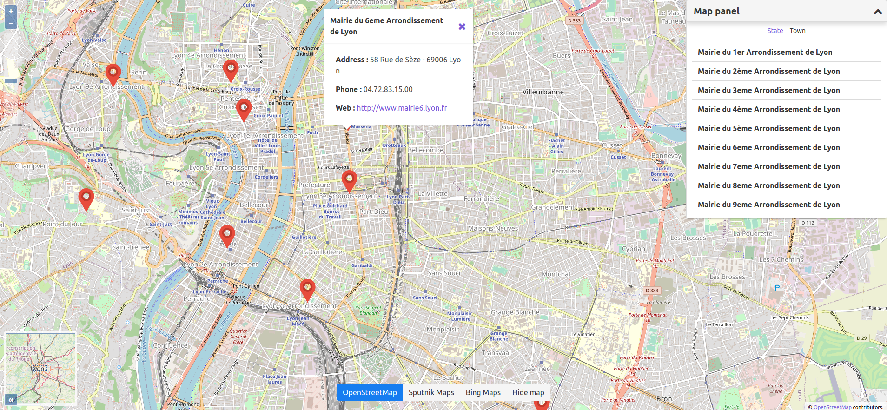

= A Spring Boot example spatial (Mysql & VueLayer)

== Frameworks used

* https://docs.spring.io/spring-boot/docs/2.4.0/reference/htmlsingle/[SpringBoot 2.4.0]
* https://hub.docker.com/layers/mysql/mysql-server/8.0.22/images/sha256-af6808dd288d6a5a34c1267fbc05dec2a01da8c9e8525d874f245f11c74cecc2?context=explore[Docker MySQL 8.0.22]
* https://fr.vuejs.org/v2/api/[VueJS 2.5.17]
* https://vuelayers.github.io/#/[VueLayer v0.11.4]

== Launch

Requires the following software : Maven (with JDK 11), NPM, Docker & Docker-Compose (> 1.13.0)

Ports used : 8080 for API, 8000 for WEB, 3306 for MySQL

*First terminal - API*

[source,bash,indent=0]
----
docker-compose up -d mysql
cd api; mvn clean spring-boot:run

# Continue when you see :
# 2020-11-21 14:33:51.625 INFO 143935 --- [main] fr.jco.api.ApiApplication : Started ApiApplication in 2.113 seconds (JVM running for 2.374)
----

*Second terminal - Web*

[source,bash,indent=0]
----
# Launch WEB
cd web; npm install; npm run start
----

Then, visit: http://localhost:8000/

== JAVA Notes

* Entity should use the right Point class.

[source,java,indent=0]
----
@Entity
public class YourEntity {
	@Column(columnDefinition = "POINT")
	private org.locationtech.jts.geom.Point point; // Use locationtech package
}
----

* Use the right dialect for spatial :

[source,yaml,indent=0]
----
spring.jpa.properties.hibernate.dialect: org.hibernate.spatial.dialect.mysql.MySQL8SpatialDialect
----

* Jackson needs https://mvnrepository.com/artifact/org.locationtech.spatial4j/spatial4j/0.7[org.locationtech.spatial4j] to READ / WRITE Geometry items

[source,java,indent=0]
----
@Configuration
public class JacksonConfig {
	// Bean to serialize / deserialize all objects which extend org.locationtech.jts.geom.Geometry (Point, Polygon, LineString)
	@Bean
	public org.locationtech.spatial4j.io.jackson.ShapesAsGeoJSONModule shapeAsJson() {
		return new org.locationtech.spatial4j.io.jackson.ShapesAsGeoJSONModule();
	}
}
----

*API Result :*

[source,json,indent=0]
----
{
  "id":1,
  "name":"Mairie du 1er Arrondissement de Lyon",
  "point": {
    "type": "Point",
    "coordinates": [45.76944, 4.8301]
  },
  "address": "2 place Sathonay - 69283 Lyon",
  "phone": "04.72.98.54.04",
  "webSite": "https://www.mairie1.lyon.fr"
}
----

Enjoy !
